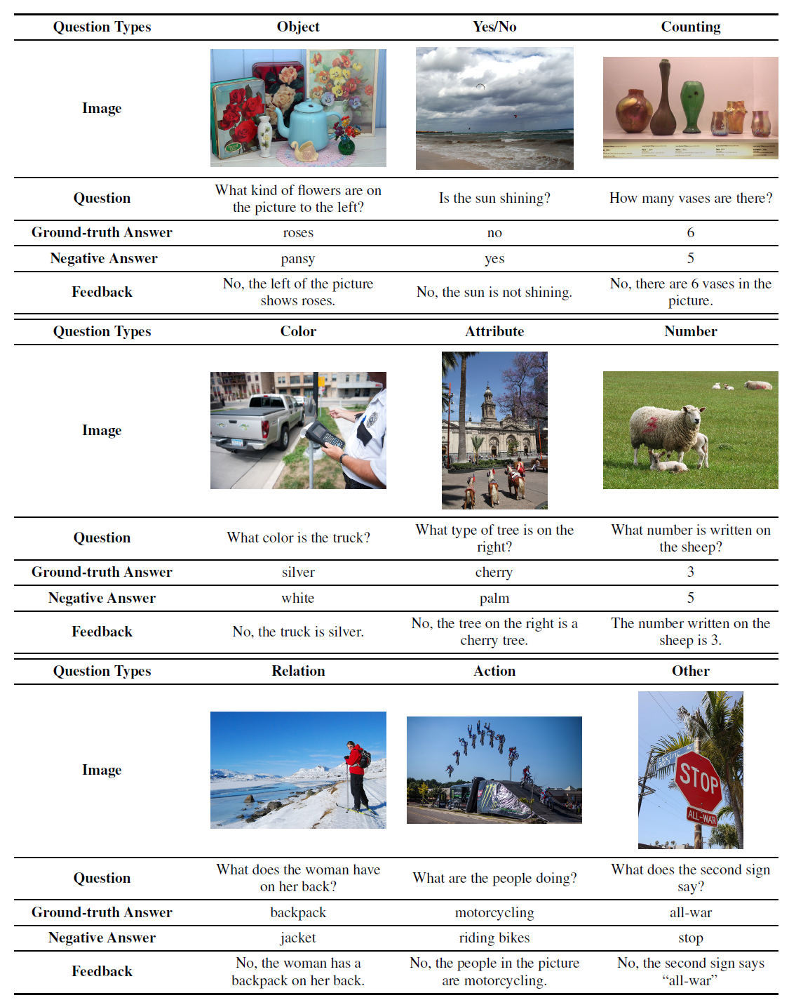

# LOVA3: Learning to Visual Question Answering, Asking and Assessment

## Abstract

Question answering, asking, and assessment are three innate human traits crucial for understanding the world and acquiring knowledge. By enhancing these capabilities, humans can more effectively utilize data, leading to better comprehension and learning outcomes. However, current Multimodal Large Language Models (MLLMs) primarily focus on question answering, often neglecting the full potential of questioning and assessment skills. In this study, we introduce LOVA3, an innovative framework named ``Learning tO Visual Question Answering, Asking and Assessment,'' designed to equip MLLMs with these additional capabilities. Our approach involves the creation of two supplementary training tasks GenQA and EvalQA, aiming at fostering the skills of asking and assessing questions in the context of images. To develop the questioning ability, we compile a comprehensive set of multimodal foundational tasks. For assessment, we introduce a new benchmark called EvalQABench, comprising 64,000 training samples (split evenly between positive and negative samples) and 5,000 testing samples. We posit that enhancing MLLMs with the capabilities to answer, ask, and assess questions will improve their multimodal comprehension and lead to better performance. We validate our hypothesis by training an MLLM using the LOVA3 framework and testing it on 10 multimodal benchmarks. The results demonstrate consistent performance improvements, thereby confirming the efficacy of our approach.

## 💡Key Contributions:

* **LOVA3** - To the best of our knowledge, LOVA3 is the first effort to imbue the asking and assessment abilities in training a robust and intelligent MLLM.
* **EvalQABench** - We build a new benchmark EvalQABench for the VQA evaluation as the first effort to advance the development of future research.


**Usage and License Notices**: The data, and code is intended and licensed for research use only. They are also restricted to uses that follow the license agreement of LLaMA, Vicuna. The dataset is CC BY NC 4.0 (allowing only non-commercial use) and models trained using the dataset should not be used outside of research purposes. 

## GenQA
If one MLLM is able to successfully generate high-quality question-answer pairs based on visual input, it indicates a stronger problem-solving ability. To enable the MLLM to ask questions, we carefully define five main multimodal data types as listed in following table.
<p align="center"></p>


## EvalQA

### Automatic Data Generation Pipeline
Illustration of the proposed pipeline for generating negative answers and feedback.
<p align="center"></p>

### Selected examples from EvalQABench

<p align="center"></p>

### EvalQABench Results

<p align="center"></p>

## Main Results

<p align="center"></p>

<p align="center"></p>

<p align="center"></p>

## Install

```shell
conda create -n LOVA python=3.10
conda activate LOVA
pip install --upgrade pip
pip install -e .
```

## Training Data

The training data for our LOVA3 model includes tasks such as VQA, GenQA, and EvalQA. The whole dat file is over 1GB in size, and we will release it on HuggingFace. 

Here we provide the training/Evaluation/Testing sets under the folder `EvalQABench`.


## Evaluation

The model weights are over 14GB, making it impractical to upload them in supplementary material. Instead, we will release them on HuggingFace.

Take VizWiz as an example, run the following command with download our pretrained weight `LOVA3-llava-v1.5-7b`.

```
modelname=LOVA3-llava-v1.5-7b

python -m llava.eval.model_vqa_loader \
    --model-path checkpoints/$modelname \
    --question-file ./playground/data/eval/vizwiz/llava_test.jsonl \
    --image-folder /yourpath/vizwiz/test/ \
    --answers-file ./playground/data/eval/vizwiz/answers/$modelname.jsonl \
    --temperature 0 \
    --conv-mode vicuna_v1

python scripts/convert_vizwiz_for_submission.py \
    --annotation-file ./playground/data/eval/vizwiz/llava_test.jsonl \
    --result-file ./playground/data/eval/vizwiz/answers/$modelname.jsonl \
    --result-upload-file ./playground/data/eval/vizwiz/answers_upload/$modelname.json

```

## Training

1. Download the pretrained MLP adapter weights [llava-v1.5-mlp2x-336px-pretrain-vicuna-7b-v1.5](https://huggingface.co/liuhaotian/llava-v1.5-mlp2x-336px-pretrain-vicuna-7b-v1.5) from and put it under the folder `checkpoints`.

2. Download the model weight [clip-vit-large-patch14-336](https://huggingface.co/openai/clip-vit-large-patch14-336) under the folder `checkpoints`.

3. Download the model weight [vicuna-7b-v1.5](https://huggingface.co/lmsys/vicuna-7b-v1.5) under the folder `checkpoints`.

4. Download the training data `Mixed_VQA_GenQA_EvalQA_1.5M.jsonl` under the folder `data`.

5. Run the training script.

```
bash scripts/v1_5/finetune.sh
```

